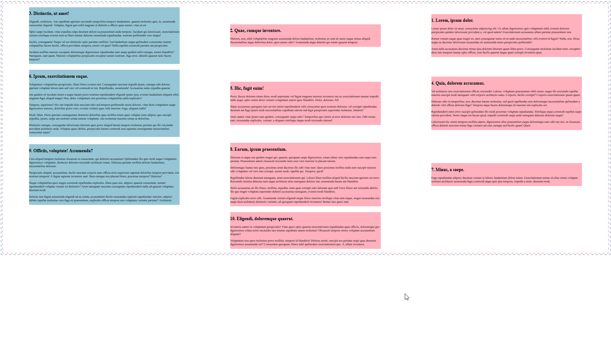

# oe-flexboxgrid-flexbox
In deze oefening ga je aan de slag met flexbox.

## Opdracht
Je krijgt alvast een HTML-bestand waarin een aantal `articles` staan. 
Bekijk de afbeelding hieronder en maak deze zo goed mogelijk na.
**Denk goed na over welk element kan dienen als flex container!**

## Regels voor deze opdracht
* Er mag **niets** gewijzigd worden aan de HTML
* Je maakt **geen** gebruik van CSS-klasses en/of id's
* Zorg ervoor dat elk derde artikel blauw wordt door een gebruik te maken van een passende pseudo-selector

## Extra
In CSS is het mogelijk om variabelen te gebruiken. Gebruik deze in je uitwerking.

Daarvoor definieer je in de `:root { ... }` je variabelen samen met hun waarde.
Bijvoorbeeld: 
```
:root {
    --pink-dark: rgb(255, 177, 190);
    --blue-dark: rgb(150, 198, 214);
}
```

Vervolgens kan je deze variabelen op deze manier aanspreken:
```
p {
  color: var(--pink-dark);
}
```

## Voorbeeld uitwerking

